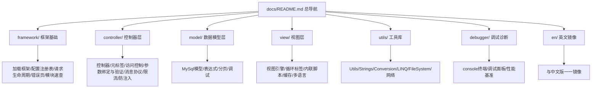
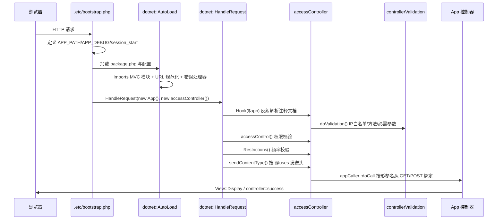

## 用户需求

为 PHP 网站的运行时框架 `framework/php.NET` 更新其 `docs` 文件夹中的 Markdown 帮助文档。现有文档相对于最新框架源码已经陈旧，且存在大量内容缺失。需要基于最新框架源码更新既有文档，并为高频使用的框架组件补全帮助文档。

## 已确认的关键决策

1. **覆盖范围**：更新现有全部 20 篇文档 + 新增高频组件文档（不做全部 118 个源文件的全量 API 参考）
2. **文档语言**：**先全量中文** —— 新文档用中文编写，现有旧文档的英文正文也全部转换为中文；中文版全部完成后，**再生成一份镜像的英文版本**
3. **示例来源**：全部取自本站真实代码（`src/` 控制器、`scripts/` 数据库脚本、`.etc/` 配置引导）
4. **组织结构**：重建索引与分类目录，根 README 作为完整导航，各子目录 README 列出本类索引，按需新增分类目录

## 产品概述

一套面向 php.NET 框架使用者的完整中文帮助文档站点（GitHub Pages 发布），配套一份结构一一对应的英文镜像版本。文档以「快速上手 → 控制器 → 模型 → 视图 → 工具库 → 调试」为主线，所有 API 签名、元标签语义、返回结构与源码逐字一致，所有示例代码来自本站真实可运行代码。

## 核心功能

### 一、修订现有文档（20 篇）

- **正文中文化**：`controller/meta.md`、`controller/controller.md`、`controller/message_protocol.md`、`controller/accessController.md`、`controller/avoid_SQL_injection.md`、`model/mysql_model.md`、`model/expression.md`、`model/debug.md`、`view/view.md`、`framework/*.md` 等英文正文全部改写为中文
- **按源码校正**：修正与当前源码不符的内容，例如 `controller::success()` 现已启用 gzip 压缩输出、`@uses` 支持 `text` 类型、`@method` 支持 `|` 多方法与 `*` 通配、`@view`/`@debug` 标签、`Table` 的 `findfield`/`ExecuteScalar`/`distinct`/`group_by` 等既有文档未提及的 API
- **补全两篇空壳**：`view/language.md`（多语言机制）与 `view/local_cache.md`（视图缓存机制）目前仅有一行标题，需完整撰写

### 二、新增高频组件文档

- **请求处理链**：路由 `Router`、参数自动绑定 `appCaller`、请求负载 `payload`/`JsonPayload`、输入验证 `controllerValidation`、请求助手 `WebRequest`/`WebResponse`
- **数据层**：`Table` 模型完整 API 参考、数据库分页 `DbPaging`
- **视图层**：视图缓存、多语言、`foreach`/`volist` 循环标签、内联 PHP 与常量标记、HTML 压缩
- **错误与限流**：`RFC7231Error` 自定义错误页、访问频率限制 `Restrictions`/`RestrictionMySQL`
- **调试**：`console` 调试终端、调试器面板与 SQL 追踪、性能基准
- **工具库**：`Utils`、`Strings`、`Conversion`、`StringHelpers`、`Enumerable`(LINQ)、`FileSystem`、`CURL`、`URL`、`DateTime`、`Regex` 等常用助手

### 三、重建导航与索引

- 根 `README.md` 改为完整分类导航目录
- 各分类目录 `README.md` 列出本类文档清单与简介
- 新增分类目录承载工具库与调试类文档
- 保持 `_config.yml`、`CNAME`、`manifest.json`、`favicon.ico` 等 GitHub Pages 发布配置可用

### 四、英文镜像版本

中文文档全部定稿后，生成结构一一对应的英文镜像版本，目录层级、文件名、章节顺序与中文版保持镜像关系。

## 技术栈

- **文档格式**：Markdown（GitHub Flavored Markdown）
- **发布方式**：GitHub Pages + Jekyll（已确认 `docs/_config.yml` 内容为 `theme: jekyll-theme-architect`，另有 `CNAME`、`manifest.json`、`favicon.ico`）
- **文档语言**：中文正文 + 英文 API 标识符/代码示例；后续生成英文镜像版
- **源码依据**：`d:/registry/framework/php.NET/Framework`（118 个 PHP 文件）
- **示例依据**：`d:/registry/src`（6 个控制器）、`d:/registry/scripts`（含子目录的数据库脚本）、`d:/registry/.etc`（bootstrap/access/registry/config）

## 实施策略

### 核心方法

采用「**源码逐字核对 → 中文撰写 → 真实示例嵌入 → 索引重建 → 英文镜像**」的五阶段流水线。每篇文档撰写前先读取对应源码文件确认签名与行为，撰写时从 `src/`、`scripts/`、`.etc/` 中摘取真实调用片段作为示例，避免臆造 API。

### 关键技术决策

**决策 1：中英分阶段而非同步双语**
用户明确要求先完成全部中文，再生成英文镜像。好处是中文定稿后英文翻译有唯一稳定的信息源，避免两版本内容漂移。英文版放在 `docs/en/` 子目录，与中文版形成镜像结构，中文版保留在原有路径（保证既有外链与 GitHub Pages 首页不失效）。

**决策 2：保留既有四大分类，增量扩展两个新分类**
现有 `controller/`、`model/`、`view/`、`framework/` 四个目录语义清晰且已被外部引用，予以保留。新增 `utils/`（工具库）与 `debugger/`（调试与诊断）两个目录承载新文档。既有文档的相对链接（如 `../controller/meta.md`、`../model/expression.md`）在改写时必须同步保持有效。

**决策 3：文档粒度按「使用频率」而非「源文件数量」切分**
不为 118 个源文件逐一建档。高频组件（控制器链、Table 模型、视图引擎、请求助手、工具类）单独成篇并深入展开；低频/外围组件（websocket、docker、WkHtmlToPdf、BEncode、taskhost）在 `framework/modules.md` 中以「模块速查表」形式集中列出，给出 `Imports()` 路径与一句话用途，避免文档体量失控同时保证可发现性。

**决策 4：示例代码必须可追溯**
每个示例标注来源文件路径（如「示例来自 `src/registry.php`」），便于读者对照真实项目理解。对来自真实代码的片段做最小化裁剪，保留框架 API 调用原貌。

### 需要重点修正的源码与文档不一致点（已核实）

| 位置 | 现有文档描述 | 源码实际行为 |
| --- | --- | --- |
| `controller::success` | 仅 `header` + `echo dotnet::successMsg` | 实际增加了 `header('Content-Encoding: gzip')` 并 `gzencode` 压缩输出，签名为 `success($message, $debug = NULL)` |
| `@uses` 标签 | 文档列出 view/api/soap/router/text | 源码 `sendContentType()` 确认 5 种；但 `src/registry.php` 中还使用了 `@uses file`（落入 default 分支不发送 content-type），需说明 |
| `@method` | 文档称「只支持 GET 或 POST」 | 源码 `getMethods()` 支持 ` | ` 分隔多方法与 `*` 通配 |
| `@debugger` | 文档只提 `debugger` | 源码 `getDebuggerOption()` 同时读取 `debugger` 与 `debug` 两个标签名 |
| `@view` | 文档未提及 | 源码 `getView()` 支持为控制器单独指定视图文件路径 |
| Table 模型 | 文档仅覆盖 where/select/find/add/save/delete/limit/count/left_join/on/order_by | 源码另有 `distinct()`、`group_by($keys)`、`findfield($name)`、`ExecuteScalar($aggregate)`、`select($fields, $keyBy, $sql_expr)`、`add($data, $strict)`、`save($data, $limit1, $safe)`、`where($assert, $and)` |
| 视图 API | 文档只讲 Display/Show/Load | 源码另有 `View::Push($name, $value)`（`*` 可批量推送）、`View::ScriptTagData($id, $data, $base64)`、`Show()` 支持 `.php`/`.phtml` 模板（以 include + 变量方式渲染） |
| 视图缓存 | 空壳文档 | `ViewCache::doCache` 由 `CACHE` 配置项开启，缓存路径含 `APP_VERSION`、模板 mtime、`REQUEST_URI` 与语言的 md5；`APP_DEBUG` 下永不命中缓存；非调试模式下按 `CACHE.MINIFY` 决定是否压缩 |
| 多语言 | 空壳文档 | `View::LoadLanguage` 约定语言文件为 `<视图同名>.<lang>.php`；`dotnet::GetLanguageConfig()` 依次从 `$_GET` → `$_COOKIE` → `$_SESSION` → `HTTP_ACCEPT_LANGUAGE` 取值；`MapLanguageCode` 支持 zhCN/enUS/frFR/ruRU |
| 错误页 | 文档只提 RFC7231 目录配置 | 源码 `RFC7231Error` 提供 `err204/400/403/404/405/429/500`，429 会自动发送 `Retry-After: 3600`，并支持 `RFC7231Error::$logger` 注入日志 |


### 性能与可维护性考量

文档为纯静态 Markdown，无运行时性能问题。可维护性上采取：统一每篇文档的章节骨架（用途简介 → 快速上手 → API 参考表 → 真实示例 → 注意事项 → 相关文档链接），使后续增补有章可循；所有跨文档引用使用相对路径，确保 GitHub Pages 与本地预览均可跳转。

## 架构设计

### 文档信息架构



### 请求生命周期（文档需准确描述的核心链路，已核实）



## 目录结构

```
d:/registry/framework/php.NET/docs/
├── README.md                          # [MODIFY] 改为完整中文导航首页。保留 ASCII Logo，重建 TOC 为六大分类（框架基础/控制器/模型/视图/工具库/调试），每类列出文档清单与一句话简介，并在页首提供「5 分钟快速上手」入口与英文版入口链接
├── _config.yml                        # [KEEP] Jekyll 主题配置，内容为 theme: jekyll-theme-architect，不改动
├── CNAME / manifest.json / favicon.ico # [KEEP] GitHub Pages 发布资产，不改动
│
├── quickstart.md                      # [NEW] 快速上手。以 .etc/bootstrap.php 为主线讲解最小可运行网站：定义 APP_PATH/APP_DEBUG/MAINTENANCE_MODE 常量、session_start、include package.php、include access.php 与 registry.php、dotnet::AutoLoad(config) 、dotnet::HandleRequest(new App(), new accessController())；配合 src/index.php 的 index() 控制器与 View::Display() 展示完整闭环
│
├── framework/
│   ├── README.md                      # [MODIFY] 本类中文索引，列出下列各篇
│   ├── load_framework.md              # [MODIFY] 中文化。修正为本站真实加载方式（.etc/bootstrap.php 中 include APP_PATH."/framework/php.NET/package.php"），说明 Imports() 模块导入语义（内部走 bootstrapLoader::push + PhpDotNet\bootstrap::LoadModule），列出 AutoLoad 默认导入的模块清单：MVC.view/MVC.model/MVC.router/MVC.request/MVC.MySql.driver/MVC.MySql.expression/php.URL
│   ├── registry.md                    # [MODIFY] 中文化并大幅补全。依据 Registry.php 列出全部配置项：DB_* 数据库连接、多库配置、MVC_VIEW_ROOT（字符串或按脚本名分组的字典）、RFC7231、ERR_HANDLER、ERR_HANDLER_DISABLE、DEFAULT_LANGUAGE、DEFAULT_AUTH_KEY、REWRITE_ENGINE、APP_NAME、APP_TITLE、APP_VERSION、TEMP、CACHE、CACHE.MINIFY、show.stacktrace；说明 DotNetRegistry::Read/AppName/DefaultLanguage/RFC7231Folder/GetMVCViewDocumentRoot 的取值回退规则
│   ├── request_lifecycle.md           # [NEW] 请求生命周期。用时序图与分步说明串联 bootstrap → AutoLoad → HandleRequest → Hook（反射 + 注释解析）→ controllerValidation → accessControl → Restrictions → sendContentType → appCaller 参数绑定 → 控制器执行 → 调试器输出/退出；说明无 accessController 时退化为 Router::HandleRequest 的分支
│   ├── handle_http_error.md           # [MODIFY] 中文化并补全。依据 RFC7231/index.php 列出 err204/err400/err403/err404/err405/err429/err500 全部入口与 $httpErrors 映射表；说明自定义错误页命名规则（<code>.html）、RFC7231 目录配置与回退到框架内置页的逻辑、429 自动发送 Retry-After: 3600、模板可用变量 {$url}/{$message}/{$description}/{$title}、RFC7231Error::$logger 日志注入
│   └── modules.md                     # [NEW] 模块速查表。以表格集中列出低频/外围模块的 Imports 路径与用途：php.websocket.*、php.docker.Docker、php.taskhost.*（含 BackgroundProcess、Rscript、jsonRPC）、php.WkHtmlToPdf、php.BEncode、php.htaccess、php.ScraperChallenge、php.Xml、Microsoft.VisualBasic.ApplicationServices.ZipLib、Microsoft.VisualBasic.Net.OPENSSL_AES、Microsoft.VisualBasic.CommandLine.*、System.Collection.*、System.Security.Cryptography.HashAlgorithm 等
│
├── controller/
│   ├── README.md                      # [MODIFY] 本类中文索引
│   ├── controller.md                  # [MODIFY] 中文化并补全。说明 App 类公开方法即 RESTful 接口、index 为默认控制器、URL 形式 /xxx.php?app=name 与本站重写后的 /name/ 形式；补充默认仅接受 GET、@method 可用 | 分隔与 * 通配；示例取自 src/index.php 与 src/registry.php
│   ├── meta.md                        # [MODIFY] 中文化并按源码校正全部元标签。逐项覆盖 @access、@uses（view/api/soap/router/text，并说明未识别值如 file 落入默认分支不发送 content-type）、@accept（| 分隔，localhost 自动展开为本机 IP 列表）、@origin、@require（i32/boolean/string 校验规则与 400 触发）、@cache、@method（| 与 *）、@debugger 与 @debug 同义、@view 指定视图路径、@rate（min/hour/day）、@xframe（deny/sameorigin/域名 → CSP frame-src）；示例全部换为 src/ 中真实注释块
│   ├── accessController.md            # [MODIFY] 中文化并以本站 .etc/access.php 为范例重写。说明必须继承 controller 抽象类并实现 accessControl()，可选重写 Redirect($code)、Restrictions()、handleNotFound()、recordNotFoundActivity()；展示本站真实做法：维护模式跳转、RestrictionMySQL 频率审计、AccessByEveryOne() 放行公开资源、未登录跳转 /login/?goto=
│   ├── request_binding.md             # [NEW] 参数绑定与请求助手。说明 appCaller::doCall 通过 ReflectionMethod 按形参名从 WebRequest 取值、可选参数取默认值、strict 模式下缺失必填参数触发 400；完整列出 WebRequest 的 get/has/getBool/getInteger/getNumeric/getPath/getList/is_pattern 与 WebResponse 的 content_type/sendContent；说明 payload 接口与 JsonPayload 用于自定义数据源调用；示例取自 src/index.php 多参数控制器（如 metabolites 的 page/topic/list 等）
│   ├── validation.md                  # [NEW] 输入验证。依据 controllerValidation 说明 doValidation 的三步顺序（IP 白名单 → HTTP 方法 → 必需参数）、getAccepts 中 localhost 展开、i32/boolean/默认非空三类校验规则及 400/403/405 触发条件与错误消息格式
│   ├── restrictions.md                # [NEW] 访问频率限制。说明 @rate 标签解析（60/min、1500/hour、3000/day）、controller::HasRateLimits()、Restrictions() 重写约定（返回 true 表示超限触发 429）、Restrictions 类的 Check()/Description()/minute()/hour()/day()；以本站 .etc/access.php 中 RestrictionMySQL 审计并写入 audit_warnings 表的真实代码为示例
│   ├── message_protocol.md            # [MODIFY] 中文化并按源码校正。修正 controller::success 现为 gzip 压缩输出（Content-Encoding: gzip + gzencode）、签名 success($message, $debug = NULL) 与 error($message, $errCode = 1, $debug = null)、error 刻意返回 HTTP 200 以兼容 jQuery success 回调；说明 {code, info, debug} 协议与 dotnet::successMsg/errorMsg；示例取自 src/registry.php 的 controller::success 调用
│   └── avoid_SQL_injection.md         # [MODIFY] 中文化并补全。保留 @require 与 WebRequest 两种手段，补充第三种：Table 模型的 ~ 原生表达式风险点与 Regex::Match 提取数字的真实做法（示例取自 src/index.php 的 spectrum/motif 控制器中 Regex::Match($metab,"\d+")）
│
├── model/
│   ├── README.md                      # [MODIFY] 本类中文索引
│   ├── mysql_model.md                 # [MODIFY] 中文化并补全为完整 Table API 参考。在既有 where/select/find/add/save/delete/limit/count/left_join/on/order_by 基础上补充 distinct()、group_by($keys)、findfield($name)、ExecuteScalar($aggregate)、select($fields,$keyBy,$sql_expr)、add($data,$strict)、save($data,$limit1,$safe)、where($assert,$and) 与 and()/or() 链式；说明单库与多库配置写法及 new Table(["db"=>"table"]) 形式；示例取自本站 scripts/ 与 .etc/access.php（geo_ip、search_hits、page_view 等真实表操作）
│   ├── expression.md                  # [MODIFY] 中文化。保留 ~ 原生表达式与 lt/lt_eq/eq/not_eq/gt/gt_eq/between/not_between/in/not_in/like/not_like 助手函数表，补充字段名三种形态（普通标识符、| 与 & 组合、含括号或空格的表达式）与真实用例
│   ├── paging.md                      # [NEW] 数据分页。依据 DbPaging 说明返回结构 {page, total_page, current_page, endOfPage, debug, maxid, count}；覆盖 totalArrayPages($array,$page_size)、array_page($array,$page,$page_size)、RetrivePage($tableName,$id,$condition,$limits)；解释 $id 为数字时默认 id 列、为 ["idName"=>start] 时指定列，condition 与 id 条件构成 AND，maxid < start 时直接返回空页；示例结合本站 scripts/ 中带 page 参数的列表查询
│   └── debug.md                       # [MODIFY] 中文化并补全。说明 Table::getLastMySql($code = false) 与 getLastMySqlError()，$code 为 true 时返回带语法高亮的 HTML（SqlFormatter）；补充调试模式下 SQL 会自动记录到调试面板
│
├── view/
│   ├── README.md                      # [MODIFY] 本类中文索引
│   ├── view.md                        # [MODIFY] 中文化并补全。修正三大 API 关系（Display 自动定位视图 → Show 指定路径 → Load 底层渲染），补充 Show 支持 .html/.php/.phtml 三种模板（html 走字符串替换、php/phtml 走 include + 变量注入）、视图自动查找顺序（同名 .html → .php → .phtml）、@view 标签覆盖路径、View::Push 预置变量（* 批量）、View::ScriptTagData 输出 JSON 脚本标签、注释文档自动注入 title/description/authors/appName/canonical；MVC_VIEW_ROOT 按脚本名分组配置；示例取自 src/index.php 的 View::Display/View::Show(APP_VIEWS."/...") 真实调用
│   ├── template_syntax.md             # [NEW] 模板语法总览。系统整理 {$变量}、{#常量}、${片段路径} 递归包含、{文件/控制器} 与 {<目录>文件/控制器} URL 简写、<foreach @array></foreach>、<volist name="" id="" empty=""></volist>、PHP 内联标签；每种语法给出模板片段 + 控制器数据 + 渲染结果三段式示例
│   ├── volist_foreach.md              # [NEW] 循环渲染标签详解。依据 volist.php 说明 name 必填（缺失抛异常）、id 别名默认取 name、empty 属性在数据为空时的替代输出（默认输出红色 Empty volist=xxx 提示）、变量引用形式 {$id.field}；对比 foreach 标签用法与适用场景
│   ├── inline_script.md               # [NEW] 内联脚本与常量。依据 inline.php 说明 {#常量名} 从 get_defined_constants(true)['user'] 取值；PHP 内联标签依赖服务器 allow_url_include = On，关闭时仅输出警告并原样返回；调试模式下会检测未替换的 {$变量} 并在终端给出告警
│   ├── local_cache.md                 # [MODIFY] 当前仅一行标题，需完整撰写。依据 ViewCache 说明由配置项 CACHE 开启；缓存路径为 <TEMP>/<APP_VERSION>/<模板文件名>/<模板mtime>/<md5(REQUEST_URI+lang)>.html；APP_DEBUG 下总是重建缓存不命中；非调试模式按 CACHE.MINIFY 决定 HtmlMinifier 压缩；缓存目录不可写时抛出异常；提示片段更新不改主模板 mtime 时需靠 APP_VERSION 刷新缓存
│   └── language.md                    # [MODIFY] 当前仅一行标题，需完整撰写。依据 View::LoadLanguage 与 dotnet::GetLanguageConfig 说明语言文件命名约定 <视图名>.<lang>.php（返回键值对数组）、片段级语言文件同样生效、控制器 vars 优先级高于语言文件、语言来源优先级 $_GET → $_COOKIE → $_SESSION → HTTP_ACCEPT_LANGUAGE、MapLanguageCode 支持 zhCN/enUS/frFR/ruRU、自动注入 html_lang/language/locale 变量、DEFAULT_LANGUAGE 配置项
│
├── utils/                             # [NEW DIR] 工具库分类
│   ├── README.md                      # [NEW] 工具库索引
│   ├── utils.md                       # [NEW] Utils 常用助手。覆盖 isDbNull、ReadValue、Tuple、KeyValueTuple、First、count、URL、Now、UnixTimeStamp、UserIPAddress、PushDownload、get_MIMEcontentType、RandomASCIIString、UnitSize、ArrayCopy、ArrayReorder、AuthCode、IsWindowsOS 等；示例取自 src/ 与 .etc/access.php 中 Utils::isDbNull / Utils::ReadValue / Utils::UserIPAddress / Utils::URL 的真实用法
│   ├── strings.md                     # [NEW] 字符串与类型转换。覆盖 Strings（Empty/LCase/UCase/Split/Replace/Mid/Len/Join）、Conversion（CBool/CInt/CDbl/isBoolFactorString）、StringHelpers（IsPattern/GetTagValue/GetStackValue）、Regex（Match/Matches）；示例取自 src/index.php 的 Strings::Split 与 Regex::Match
│   ├── linq.md                        # [NEW] LINQ 风格集合操作。覆盖 Enumerable 的 Join/OrderBy/OrderByDescending/OrderByKey/OrderByKeyDescending/Select/GroupBy/ToDictionary/Last/Where/SkipWhile，配合 Imports("System.Linq.Enumerable") 说明
│   └── net_io.md                      # [NEW] 网络与文件 IO。覆盖 Microsoft.VisualBasic.Net.CURL、MimeTypes、DataURI，Microsoft.VisualBasic.FileIO.FileSystem，System.IO.File/Path，php.URL（含 NormalizeRedirectArguments）与全局 Redirect() 的用法；示例结合 src/index.php 的 Redirect("/metabolite/...") 真实跳转
│
├── debugger/                          # [NEW DIR] 调试与诊断分类
│   ├── README.md                      # [NEW] 调试分类索引
│   ├── console.md                     # [NEW] 调试终端。覆盖 console::log/warn/error/dump/table/objDump/printCode/openlog/flush 与 error_handler；说明 CLI 与 Web 两种输出模式
│   └── debug_panel.md                 # [NEW] 调试面板与性能基准。说明 APP_DEBUG 常量开关（本站 .etc/bootstrap.php 中定义为 false）、@debugger/@debug 标签的单控制器覆盖、调试面板仅对 @uses view 控制器渲染、api 控制器写入 debug session（DEBUG_SESSION cookie）、debugView::LogEvent/AddItem/DebugVars、Ubench 基准项 benchmark.init/benchmark.exec/benchmark.template、show.stacktrace 配置项
│
└── en/                                # [NEW DIR] 英文镜像版本（中文版定稿后生成）
    ├── README.md                      # [NEW] 英文导航首页，结构镜像中文根 README
    ├── quickstart.md                  # [NEW]
    ├── framework/                     # [NEW] 镜像 framework 全部文档
    ├── controller/                    # [NEW] 镜像 controller 全部文档
    ├── model/                         # [NEW] 镜像 model 全部文档
    ├── view/                          # [NEW] 镜像 view 全部文档
    ├── utils/                         # [NEW] 镜像 utils 全部文档
    └── debugger/                      # [NEW] 镜像 debugger 全部文档
```

## 实施要点

### 准确性保障

- 每篇文档撰写前必须先读取对应源码文件，API 签名、默认参数值、标签名称、返回结构均以源码为准，禁止臆造
- 已核实的关键事实必须准确体现：`Router::getApp()` 的调试器分支返回 `this_is_a_debugger_api_calls!!!`；`AssignController` 的 URL 简写正则与 `<目录>` 前缀语义；`validateArgument` 的 i32 正则 `[-]?\d+`；`DbPaging::RetrivePage` 的 endOfPage 判定为 `current >= pages`；`ViewCache::getCachePath` 的路径组成
- 示例代码从 `src/`、`scripts/`、`.etc/` 摘取后需保持 API 调用原貌，并标注来源文件

### 链接与结构一致性

- 既有文档中的相对链接（`../controller/meta.md`、`../model/expression.md`、`../framework/registry.md`）在改写后必须仍然有效
- 新增分类目录后，根 README 与各子目录 README 的索引必须覆盖全部文档，无遗漏、无死链
- 英文镜像版内部链接需指向 `en/` 内对应文件，中英版本互相提供入口链接

### 影响范围控制

- 只修改 `framework/php.NET/docs` 目录内容，不触碰框架源码、站点 `src/`、`scripts/`、`.etc/` 任何文件
- 不改动 `_config.yml`、`CNAME`、`manifest.json`、`favicon.ico`，保证 GitHub Pages 发布不中断
- 保留根 README 的 ASCII Logo 等既有视觉元素

## Agent Extensions

### SubAgent

- **code-explorer**
- 用途：在撰写工具库（`utils/`）与模块速查表（`framework/modules.md`）文档前，批量探查 `Microsoft/VisualBasic/*`、`System/*`、`php/*` 等目录下多个源文件的公开类与方法签名，以及在 `src/`、`scripts/` 中检索这些 API 的真实调用点作为示例素材
- 预期结果：产出准确的 API 清单（类名、方法签名、`Imports()` 路径）与真实调用示例位置，供文档撰写直接引用，避免逐文件手工读取造成遗漏或臆造